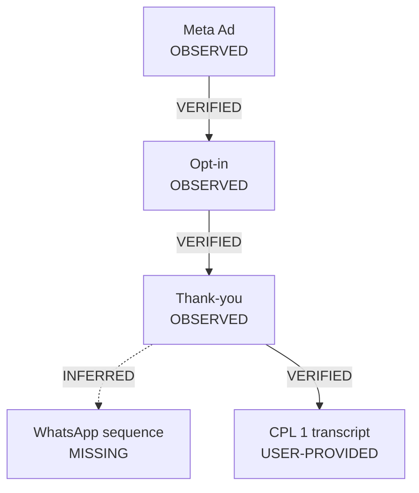

# Reconstruction Workflow

## 1. Build the Node Ledger

Create one row per asset or state:

| Node | Source IDs | Channel | Market | Locale | State | Role | Notes |
| --- | --- | --- | --- | --- | --- | --- | --- |
| N-001 | SRC-001 | Meta | BR | pt-BR | OBSERVED | acquisition ad | active date observed; no performance data |

Useful roles: acquisition, pre-frame, opt-in, confirmation, nurture, CPL/PLC, event, sales argument, offer, checkout, upsell, downsell, booking, call, onboarding, retention, reactivation.

## 2. Build the Edge Ledger

Edges require evidence:

| From | To | State | Source IDs | Basis | Confidence |
| --- | --- | --- | --- | --- | --- |
| N-001 | N-002 | VERIFIED | SRC-001, SRC-002 | ad destination resolves to landing | high |
| N-004 | N-005 | INFERRED | SRC-006 | CTA language references next class; click unavailable | medium |

Never add an edge solely because it is common practice.

## 3. Order Time-Based Channels

Normalize dates and timezones where possible. Preserve original timestamps. For WhatsApp/email/PLF sequences, analyze:

- message frequency and intervals;
- anticipation and reminders;
- link destinations;
- belief sequence and objections;
- proof and urgency;
- Open Cart and close cadence;
- parallel or conflicting messages across channels.

If timezone is unknown, state it. Do not manufacture ordering between sources that lack reliable timestamps.

## 4. Represent Branches

Support multiple ads/landers, opt-in variants, countries, device paths, remarketing, email/WhatsApp in parallel, live sessions, order bumps, external payment, applications, calls, upsells, and downsells.

Use Mermaid only when it improves clarity:



Always include a legend and echo states in text; color alone is insufficient.

## 5. Analyze by Layer

- **Market:** audience, pains, desires, awareness, sophistication, positioning.
- **Traffic:** channels, ads, hooks, angles, creative patterns.
- **Pre-frame:** advertorial, lead magnet, webinar, CPL, warm-up.
- **Copy:** headline, lead, story, mechanism, proof, objections, CTA.
- **Offer:** product, bonuses, price, anchor, guarantee, urgency, payment structure.
- **Funnel:** transitions, conversion intent, friction, branches, upsells, downsells.
- **Follow-up:** email, WhatsApp, SMS, retargeting, close, reactivation.
- **Localization:** language, framing, examples, currency/format, verified market fit.

Mark `NOT ASSESSED` when a layer is outside scope. Do not infer missing sections from a template.

## 6. Synthesize Patterns

For every important pattern, produce:

```text
Evidence: [claim + Source IDs]
Principle: [strategic function]
Hypothesis: [what may be worth testing]
Original execution: [new concept for the user's product, when requested]
Measurement: [what would confirm or reject it]
```

## 7. Stop Conditions

Stop collection when additional sources are duplicative, outside scope, private/access-controlled, materially costly without authorization, or unlikely to change conclusions. Continue analysis with documented limits.

