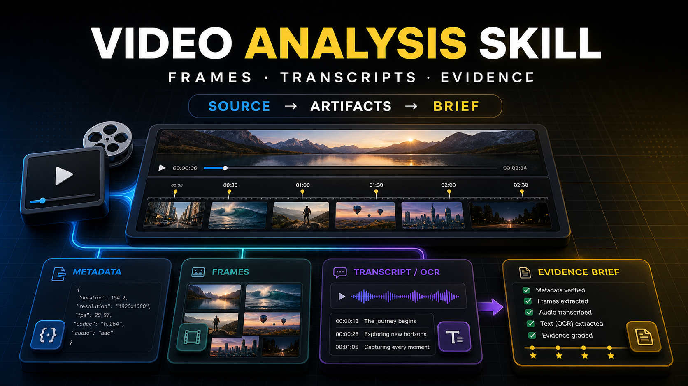

# Video Analysis Skill



**Video Analysis Skill** turns local clips and supported video URLs into reusable evidence artifacts before an AI agent makes claims about what happens, what appears on screen, or what is said.

The core rule:

> Source first. Artifacts second. Claims last.

## What It Does

| Layer | Output |
| --- | --- |
| Source lock | Local copy or downloaded source video, source metadata, normalized run folder |
| Metadata | `ffprobe.json`, stream summary, duration, codec, size, audio/video checks |
| Frames | Representative timestamped frames and a contact sheet |
| Text evidence | Existing subtitles, optional OCR, optional faster-whisper ASR |
| Quality gates | Duration and evidence availability checks |
| Evidence brief | `analysis-brief.md` and `manifest.json` for downstream reasoning |

This is a deterministic-first skill. It does not try to "watch" a video from one browser view and guess the rest. It creates an artifact set that another agent or reviewer can inspect.

## Pipeline

```text
source video or URL
  -> materialize source
  -> ffprobe metadata
  -> representative frames
  -> contact sheet
  -> subtitles / OCR / ASR when available
  -> quality gates
  -> evidence brief
```

## Quick Start: Prompt Install

Paste this into an AI agent that can access GitHub and write local files:

```text
Install Video Analysis Skill from this public repository:
https://github.com/BYDFi2025/video-analysis-skill

If you can persist skills in this environment:
1. Clone or download the repository.
2. Install it as a skill named video-analysis in the appropriate skill directory for this agent.
3. Include SKILL.md, references, scripts, agents, requirements, Dockerfile, and README.
4. Do not copy .git, artifacts, caches, generated outputs, virtual environments, or temporary files.
5. From the repository root, run python scripts/doctor.py --profile full --repair-plan.
6. If dependencies, tools, Docker, OCR, ASR, or local transcription models are missing, show me the repair options first and ask before changing the system.

If you cannot persist skills:
1. Load SKILL.md and the relevant references for this chat only.
2. Tell me clearly that this is a session-only setup.

Return:
- install mode: persistent or session-only
- installed path, if available
- doctor status
- missing dependencies
- recommended repair plan
- one safe test command or test task I can run next
```

## Local Use

Install dependencies:

```bash
python -m pip install -r requirements.txt
```

Check the environment:

```bash
python scripts/doctor.py --profile base --repair-plan
```

Check the full stack, including URL download support, OCR, ASR, Docker, and the local transcription model cache:

```bash
python scripts/doctor.py --profile full --repair-plan --format markdown
```

Preload a local ASR model before a speech-heavy task:

```bash
python -m pip install -r requirements-asr.txt
python scripts/doctor.py --profile asr --download-asr-model small --asr-model small
```

Require the ASR model to be present before continuing:

```bash
python scripts/doctor.py --profile asr --repair-plan --require-asr-model --asr-model small
```

Analyze a local video:

```bash
python scripts/video_analysis.py --input ./clip.mp4 --out artifacts --sample-count 12
```

Analyze a supported URL:

```bash
python scripts/video_analysis.py --input "https://example.com/video" --out artifacts --sample-count 12
```

Enable OCR when Tesseract is installed:

```bash
python scripts/video_analysis.py --input ./clip.mp4 --ocr auto
```

Enable local ASR when `faster-whisper` is installed:

```bash
python -m pip install -r requirements-asr.txt
python scripts/doctor.py --profile asr --download-asr-model small --asr-model small
python scripts/video_analysis.py --input ./clip.mp4 --extract-audio --asr faster-whisper --asr-model small
```

## Docker

Docker packages a reproducible runtime for users who do not want to manage local system dependencies manually.

Build the default base image. It includes Python, ffmpeg, ffprobe, yt-dlp, Pillow, pytesseract, and Tesseract OCR:

```bash
docker build --target final -t video-analysis-skill:base .
```

Run with a mounted video folder:

```bash
docker run --rm \
  -v "$PWD:/data:ro" \
  -v "$PWD/artifacts:/app/artifacts" \
  video-analysis-skill:base \
  --input /data/clip.mp4 \
  --out artifacts \
  --sample-count 12
```

Build the ASR image when local speech transcription is needed:

```bash
docker build --target asr -t video-analysis-skill:asr .
```

Build an ASR image with a preloaded transcription model:

```bash
docker build --target asr --build-arg PRELOAD_ASR_MODEL=small -t video-analysis-skill:asr-small .
```

Run ASR inside Docker:

```bash
docker run --rm \
  -v "$PWD:/data:ro" \
  -v "$PWD/artifacts:/app/artifacts" \
  video-analysis-skill:asr \
  --input /data/clip.mp4 \
  --out artifacts \
  --extract-audio \
  --asr faster-whisper \
  --asr-model small
```

## Dependency Doctor

`scripts/doctor.py` is the guided setup entrypoint. It does not silently modify the machine. It detects the current platform and returns exact repair options.

| Profile | Checks |
| --- | --- |
| `base` | Python, ffmpeg, ffprobe, Pillow, optional yt-dlp |
| `ocr` | Base video stack plus Tesseract and pytesseract |
| `asr` | Base video stack plus faster-whisper and ASR model cache |
| `full` | URL materialization, OCR, ASR, Docker, and model-cache readiness |

Common commands:

```bash
python scripts/doctor.py --profile base --repair-plan
python scripts/doctor.py --profile ocr --repair-plan --format markdown
python scripts/doctor.py --profile asr --repair-plan --require-asr-model --asr-model small
python scripts/doctor.py --profile full --repair-plan --format markdown
```

## Artifact Layout

Each run writes a timestamped folder under `artifacts/`:

```text
artifacts/<source>-<timestamp>/
├── manifest.json
├── analysis-brief.md
├── ffprobe.json
├── quality-gates.json
├── contact-sheet.jpg
├── source/
├── frames/
├── subtitles/          # when available
├── ocr/                # when enabled
└── transcript/         # when ASR is enabled
```

## Evidence Hierarchy

Use the strongest available evidence:

1. Source metadata and ffprobe for file, codec, duration, stream, and technical claims.
2. Subtitles or ASR transcript for spoken-content claims.
3. Sampled frames and contact sheets for visible-scene claims at sampled timestamps.
4. OCR for on-screen text, with lower confidence than subtitles or ASR.
5. The surrounding post, title, or page text only as context, not as proof of video contents.

If no artifact supports a claim, label it as unsupported.

## Repository Contents

```text
.
├── SKILL.md
├── README.md
├── agents/openai.yaml
├── scripts/
│   ├── video_analysis.py
│   └── doctor.py
├── references/
│   ├── evidence-grading.md
│   ├── install-and-repair.md
│   ├── workflow.md
│   └── prompt-pack.md
├── tests/
├── Dockerfile
├── requirements.txt
└── requirements-asr.txt
```

## Boundaries

- Do not claim exact speech without subtitles or ASR evidence.
- Do not infer unsampled visual details from a contact sheet.
- Do not bypass paywalls, access controls, login walls, rate limits, or platform terms.
- Do not publish private or sensitive content without user approval.
- Treat OCR as imperfect and quote it only with caution.

## License

MIT
